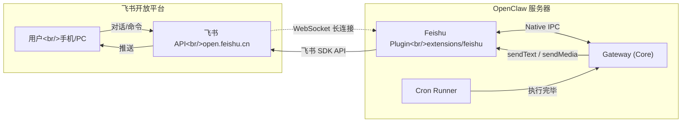
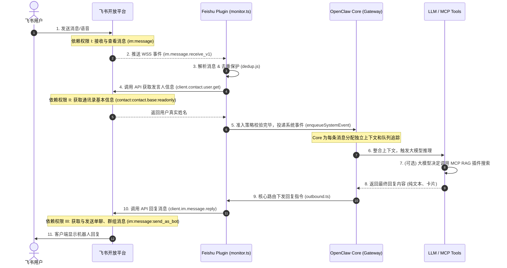
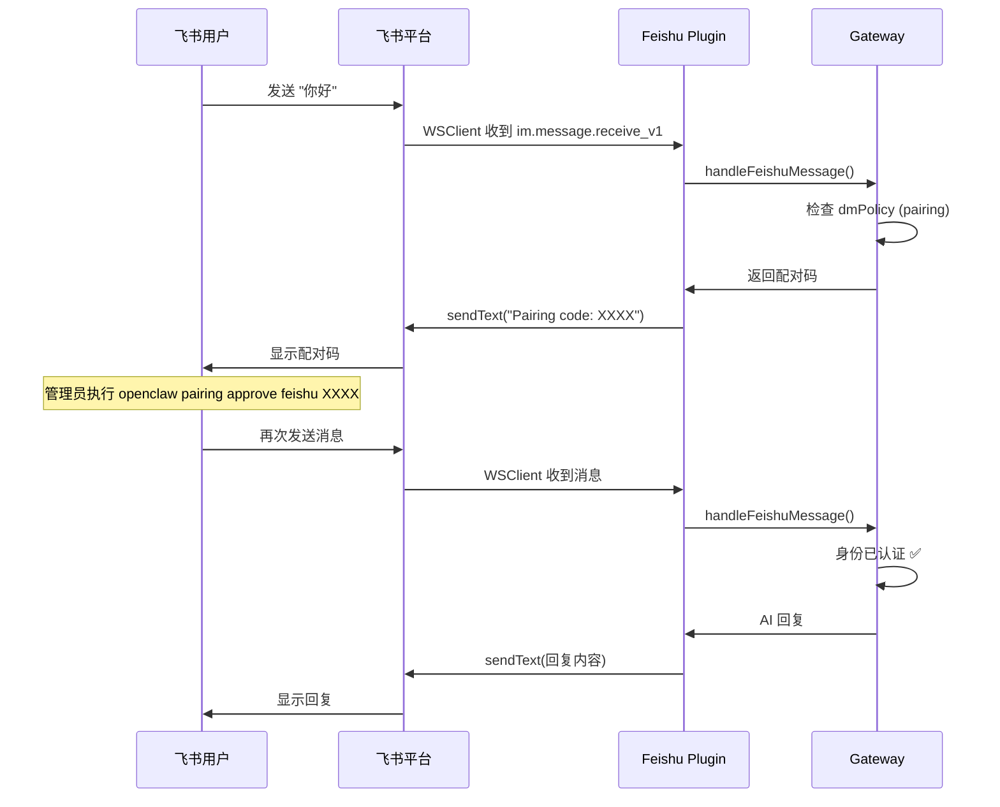

# 飞书接入开发文档（技术实现篇）

> 本文档面向开发者，记录飞书（Feishu/Lark）接入 OpenClaw 的完整技术实现细节，包括架构设计、源码走读、Cron 推送集成、排障经验以及可复用的开发模式。
> 用户侧操作指南请参考 [飞书用户文档](/zh-CN/channels/feishu)。

---

## 1. 架构总览

### 1.1 系统架构



### 1.2 两条核心通路

| 通路      | 方向 | 实现机制                                                                           |
| --------- | ---- | ---------------------------------------------------------------------------------- |
| 用户对话  | 双向 | 飞书 `WSClient` 长连接 → `monitor.ts` 事件分发 → Gateway 处理 → `outbound.ts` 回复 |
| Cron 推送 | 单向 | Cron Runner 执行 → Gateway `announce` 路由 → Feishu Plugin `sendText` → 飞书 API   |

---

## 2. 源码结构

插件源码位于 `extensions/feishu/src/`：

```
extensions/feishu/
├── index.ts          # 插件入口，导出 feishuPlugin
├── src/
│   ├── channel.ts    # 插件主定义：meta、capabilities、configSchema、gateway
│   ├── monitor.ts    # WebSocket/Webhook 事件监听与消息分发
│   ├── outbound.ts   # 出站消息适配器（文本、卡片、媒体）
│   ├── send.ts       # 底层消息发送（调用飞书 SDK）
│   ├── policy.ts     # 群组/DM 访问策略解析
│   ├── accounts.ts   # 多账号凭证解析
│   ├── targets.ts    # 目标 ID 规范化（ou_xxx / oc_xxx）
│   ├── onboarding.ts # 交互式配置向导适配
│   ├── probe.ts      # 健康检查探针
│   ├── directory.ts  # 用户/群组目录查询
│   ├── types.ts      # TypeScript 类型定义
│   ├── bitable.ts    # 飞书多维表格工具
│   ├── doc.ts        # 飞书文档工具
│   ├── wiki.ts       # 飞书 Wiki 工具
│   └── drive.ts      # 飞书云盘工具
```

### 2.1 插件注册 (`channel.ts`)

`feishuPlugin` 实现了 `ChannelPlugin<ResolvedFeishuAccount>` 接口，关键字段：

```typescript
export const feishuPlugin: ChannelPlugin<ResolvedFeishuAccount> = {
  id: "feishu",
  meta: { id: "feishu", label: "Feishu", aliases: ["lark"], order: 70 },
  capabilities: {
    chatTypes: ["direct", "channel"],
    threads: true,
    media: true,
    reactions: true,
    edit: true,
    reply: true,
  },
  configSchema: {
    /* JSON Schema 定义，见下文 */
  },
  gateway: {
    startAccount: async (ctx) => {
      // 动态 import monitor.ts，启动 WebSocket 或 Webhook 监听
      const { monitorFeishuProvider } = await import("./monitor.js");
      return monitorFeishuProvider({ config, runtime, abortSignal, accountId });
    },
  },
  outbound: feishuOutbound, // 出站消息处理
  pairing: {
    /* 配对逻辑 */
  },
};
```

### 2.2 事件监听 (`monitor.ts`)

Gateway 启动时调用 `monitorFeishuProvider()`，根据 `connectionMode` 选择监听方式：

- **`websocket`（默认推荐）**：使用 `@larksuiteoapi/node-sdk` 的 `WSClient` 建立长连接，无需公网 IP。
- **`webhook`**：在本地 Express 服务器上监听回调事件，需公网可达。

核心事件注册：

```typescript
eventDispatcher.register({
  "im.message.receive_v1": async (data) => {
    const event = data as FeishuMessageEvent;
    await handleFeishuMessage({ cfg, event, botOpenId, runtime, accountId });
  },
  "im.chat.member.bot.added_v1": async (data) => {
    /* 机器人被拉群 */
  },
  "im.chat.member.bot.deleted_v1": async (data) => {
    /* 机器人被踢群 */
  },
});
```

**消息幂等**：`handleFeishuMessage` 内部通过 `message_id` 去重，防止飞书事件重发导致重复处理。

### 2.3 访问策略 (`policy.ts`)

```typescript
// 群组准入
function isFeishuGroupAllowed(params: {
  groupPolicy: "open" | "allowlist" | "disabled";
  allowFrom: Array<string | number>;
  senderId: string;
}): boolean;

// @提及要求
function resolveFeishuReplyPolicy(params: {
  isDirectMessage: boolean;
  globalConfig?: FeishuConfig;
  groupConfig?: FeishuGroupConfig;
}): { requireMention: boolean };

// 群组配置解析（按 chat_id 精确匹配，无 default 保底键）
function resolveFeishuGroupConfig(params: {
  cfg?: FeishuConfig;
  groupId?: string;
}): FeishuGroupConfig | undefined;
```

**关键设计决策**：

- `groups` 字典按 `chat_id` 精确匹配，不存在 `"default"` 通配键
- 全局 `requireMention` 属性控制默认 @ 要求（默认 `true`）
- 群组不走 Pairing Code 认证流程，仅受 `groupPolicy` 控制

### 2.4 发言人身份解析与通讯录权限 (`bot.ts`)

在 `handleFeishuMessage` 处理入口中，OpenClaw 为了让大模型能够准确区分群聊或私聊中的不同发言人（让回复更有语境），会在收到消息时主动发请请求查询发言人的展示名称：

```typescript
// 解析发言人名称 (bot.ts)
const res: any = await client.contact.user.get({
  path: { user_id: senderOpenId },
  params: { user_id_type: "open_id" },
});
```

**关键节点授权说明**：

- 这个节点**必须**依赖飞书开放平台的**通讯录基础只读权限**（如 `contact:contact.base:readonly`）。
- **如果未授权**：飞书 API 会直接返回 `99991672` (Access denied) 的鉴权错误。虽然插件做了 catch 处理不至于让整个进程崩溃，但模型将无法得知对话者的真实称呼。
- **配置操作**：在飞书开发者后台的“权限管理”中，必须额外勾选 `获取通讯录基本信息` 权限并发布新版本应用。

### 2.5 完整消息生命周期与权限链路解析 (底层原理)

为了让开发者更好地理解 OpenClaw 是如何将飞书消息投递给底层 Agent 并在处理后返回的，这里梳理了一条完整的生命周期链路。在链路的各个关键节点，OpenClaw 都会依赖特定的飞书 API 权限。



**链路拆解与授权点映射：**

1. **[步骤 1-2] 事件接入层 (`monitor.ts`)**：
   飞书用户发出消息后，开放平台通过长连接将事件推向插件。
   - **前置权限**：`im:message`
   - **底层行为**：这是个无状态入口，如果这里丢包，OpenClaw 会对未达成的请求进行长连接重连。
2. **[步骤 3-4] 身份附魔与去重 (`bot.ts` & `dedup.js`)**：
   收到载荷（Payload）后，插件进行首轮清洗。为了避免飞书事件重发导致模型产生双份回答，`dedup` 会记录 `message_id`。紧接着，为了让模型拥有“社交直觉”（知道谁在说话），插件调用了用户详情接口提取 `display_name`。
   - **前置权限**：`contact:contact.base:readonly`
   - **底层行为**：如果你没有授权，会导致这个环节爆出 `99991672` 错误，上下文里的 `speaker` 会退化使用乱码 `ou_xxx` 作为名称，这不仅影响交互体验，还会导致模型丧失针对特定发言人记忆的能力。
3. **[步骤 5-6] 准入与网关分发 (`enqueueSystemEvent`)**：
   校验群租白名单、DM (私聊) Pairing Code 等策略是否放行。放行后调用 `core.system.enqueueSystemEvent`。
   - **底层行为**：它并不像旧版直接调用一次 RPC；它通过 Gateway 生成了一个追踪会话（Session），并通知主循环引擎开始组装当前 `history`、`system_prompt` 等系统组件。
4. **[步骤 7] 插件生态扩展 (MCP / Tools)**：
   如果是我们的 RAG 知识库，模型会在这一步中止默认流程，发起内部中断请求去查询我们的 MCP 检索服务。
5. **[步骤 9-11] 消息出站 (`outbound.ts` & `send.ts`)**：
   模型流式（Streaming）或整块回答完毕后，核心网关会将生成的结构体推送给飞书的适配器。`send.ts` 构建原始的 Feishu API 载荷（例如富文本节点）。
   - **前置权限**：`im:message:send_as_bot`
   - **底层行为**：完成回复调用 `client.im.message.reply`，将回答作为一条子消息挂载到原提问下方。

---

## 3. 配置 Schema 详解

### 3.1 全局配置

```json5
{
  channels: {
    feishu: {
      enabled: true,
      appId: "cli_xxx",
      appSecret: "xxx",
      connectionMode: "websocket", // "websocket" | "webhook"
      domain: "feishu", // "feishu" | "lark" | 自定义 URL
      dmPolicy: "pairing", // "open" | "pairing" | "allowlist"
      groupPolicy: "open", // "open" | "allowlist" | "disabled"
      requireMention: true, // 全局 @ 要求（群聊默认）
      textChunkLimit: 2000, // 出站消息分块大小
      mediaMaxMb: 30, // 媒体上传限制
      streaming: true, // 流式卡片输出
      groups: {
        oc_xxx: {
          // 按 chat_id 单独配置
          requireMention: false,
          enabled: true,
        },
      },
      accounts: {
        // 多账号配置
        main: { appId: "cli_xxx", appSecret: "xxx" },
        backup: { appId: "cli_yyy", appSecret: "yyy", enabled: false },
      },
    },
  },
}
```

### 3.2 环境变量

| 变量                | 说明            |
| ------------------- | --------------- |
| `FEISHU_APP_ID`     | 应用 App ID     |
| `FEISHU_APP_SECRET` | 应用 App Secret |

---

## 4. Cron Job 推送集成

### 4.1 前置条件

Cron 任务必须满足以下条件才能通过 `delivery` 路由输出：

| 条件            | 值            | 说明                  |
| --------------- | ------------- | --------------------- |
| `sessionTarget` | `"isolated"`  | 必须使用隔离会话      |
| `payload.kind`  | `"agentTurn"` | 必须是 Agent 执行类型 |

### 4.2 配置示例

```json
{
  "sessionTarget": "isolated",
  "payload": {
    "kind": "agentTurn",
    "message": "你的 prompt...",
    "thinking": "medium",
    "timeoutSeconds": 300
  },
  "delivery": {
    "mode": "announce",
    "channel": "feishu",
    "to": "ou_3b79e9202ff4004131525966e7d0b811"
  }
}
```

### 4.3 为什么不用 Webhook delivery？

原始方案使用 `delivery.mode: "webhook"` 向 `http://127.0.0.1:18789` 投递，被 Gateway 内置的 **SSRF 防护**拦截。
改用 `announce` 模式后，消息通过内部 IPC 直接路由到 Feishu Plugin，完全绕过 HTTP 请求环节。

### 4.4 `to` 字段取值

| 格式    | 示例           | 说明           |
| ------- | -------------- | -------------- |
| Open ID | `ou_3b79e9...` | 推送到个人私聊 |
| Chat ID | `oc_xxx...`    | 推送到群聊     |

---

## 5. 身份配对流程

### 5.1 私聊 (DM) 配对



### 5.2 群聊准入

群聊**不走配对流程**，直接由 `groupPolicy` 控制：

- `"open"`：任何群成员均可触发（需 @ 机器人，除非配置了 `requireMention: false`）
- `"allowlist"`：仅 `groupAllowFrom` 中的用户可触发
- `"disabled"`：禁用群聊

---

## 6. 排障手册

### 6.1 DNS 解析失败 (`ENOTFOUND open.feishu.cn`)

**现象**：Gateway 日志报 `AxiosError: getaddrinfo ENOTFOUND open.feishu.cn`

**原因**：LaunchAgent 进程的 DNS 环境可能与终端不同（尤其在使用 VPN/代理时）

**排查步骤**：

```bash
# 1. 终端测试 DNS
nslookup open.feishu.cn

# 2. 检查 Node.js DNS
node -e "require('dns').resolve('open.feishu.cn', console.log)"

# 3. 重启 Gateway（DNS 缓存刷新后通常自动恢复）
openclaw gateway restart

# 4. 若持续失败，检查 /etc/hosts 或代理配置
```

### 6.2 WebSocket 连接失败后自动恢复

飞书 SDK 的 `WSClient` 内置重连机制。日志中出现以下序列是正常的：

```
[ws] ws connect failed
[ws] connect failed
[ws] reconnect
[ws] ws client ready    ← 重连成功
```

### 6.3 插件重复加载 (duplicate plugin id)

**现象**：`plugin feishu: duplicate plugin id detected`

**原因**：同时存在全局内置插件（`node_modules/openclaw/extensions/feishu`）和本地安装（`~/.openclaw/extensions/feishu`）

**解决**：

```bash
# 删除本地冗余副本
rm -rf ~/.openclaw/extensions/feishu
openclaw gateway restart
```

### 6.4 Corepack 签名验证失败

**现象**：`Cannot find matching keyid` 导致 `pnpm` 无法启动

**解决**：

```bash
# 方案 A：升级 corepack
npm install -g corepack@latest

# 方案 B：禁用严格验证
COREPACK_ENABLE_STRICT=0 node scripts/run-node.mjs ...

# 方案 C：直接使用全局安装的 openclaw CLI
which openclaw && openclaw gateway restart
```

### 6.5 发言人姓名解析鉴权失败 (`code=99991672`)

**现象**：
Gateway 执行日志中抛出如下错误：
`feishu: permission error resolving sender name: code=99991672`
随后大模型在执行带群组背景的回答时，只能拿到 `ou_xxx` 作为名称。

**原因**：
机器人接收消息成功后，试图调用飞书 API (`contact/v3/users/:user_id`) 请求用户基础展示名称。但应用后台未提供相关通讯录信息的系统授权。

**解决**：

1. 访问飞书开发者后台 -> 权限管理。
2. 搜索并开启 `contact:contact.base:readonly` (获取用户基本信息)。
3. 创建新版本并发布应用。配置生效后即可恢复正常。

---

## 7. 开发模式参考（接入新 Channel）

基于飞书插件的实现经验，以下是接入新即时通讯渠道的标准模式：

### 7.1 文件结构模板

```
extensions/<channel-name>/
├── index.ts          # 导出 channelPlugin
├── src/
│   ├── channel.ts    # 实现 ChannelPlugin 接口
│   ├── monitor.ts    # 事件监听（WebSocket/Webhook/轮询）
│   ├── outbound.ts   # 出站消息适配
│   ├── send.ts       # 底层 API 调用
│   ├── policy.ts     # 访问策略
│   ├── accounts.ts   # 凭证/多账号管理
│   └── types.ts      # 类型定义
```

### 7.2 必须实现的接口

| 接口                                 | 作用                 | 飞书参考             |
| ------------------------------------ | -------------------- | -------------------- |
| `ChannelPlugin.gateway.startAccount` | 启动事件监听         | `monitor.ts`         |
| `ChannelPlugin.outbound`             | 出站消息格式化与发送 | `outbound.ts`        |
| `ChannelPlugin.configSchema`         | 配置校验             | `channel.ts` L74-125 |
| `ChannelPlugin.pairing`              | 身份绑定             | `channel.ts` L44-54  |
| `ChannelPlugin.capabilities`         | 声明支持的消息类型   | `channel.ts` L55-63  |

### 7.3 设计检查清单

- [ ] 连接模式：WebSocket 长连接 vs Webhook vs 轮询？
- [ ] 是否需要公网回调 URL？（WebSocket 模式可避免）
- [ ] 消息幂等：是否有 message_id 去重机制？
- [ ] 群组 vs 私聊：准入策略是否分离？
- [ ] 多账号：是否支持同时运行多个 bot 实例？
- [ ] 流式输出：平台是否支持消息编辑（用于流式更新）？
- [ ] 媒体传输：文件/图片/音视频的大小限制？
- [ ] Cron 推送：`announce` delivery 是否需要特殊目标格式？

---

## 8. 依赖清单

| 包名                      | 版本    | 用途                               |
| ------------------------- | ------- | ---------------------------------- |
| `@larksuiteoapi/node-sdk` | ^1.59.0 | 飞书官方 SDK（WSClient、API 调用） |
| `openclaw/plugin-sdk`     | (内置)  | 插件接口定义                       |

---

## 9. 参考链接

- [飞书开放平台](https://open.feishu.cn/)
- [飞书 Node SDK 文档](https://github.com/larksuite/node-sdk)
- [OpenClaw 飞书用户文档](/zh-CN/channels/feishu)
- [OpenClaw Gateway 配置](/gateway/configuration)
- [OpenClaw 插件开发](/plugins)
