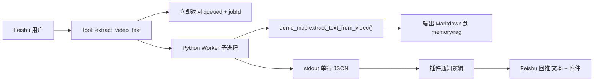

# Feishu 视频转文本插件开发复盘（新手实战版）

本文是一次真实落地的工程复盘，目标是把“发视频链接 -> 自动提取文本 -> 回传 Markdown -> 同步进 memory”做成可维护、可扩展、可排障的标准方案。

---

## 0. 先读结论

如果你和我一样是第一次在 OpenClaw 里做“长耗时工具 + 飞书回传”，直接记住这 5 条：

1. 长耗时任务不要同步跑，必须异步排队。
2. OpenClaw 插件配置里不要写 `mcp` 字段（会直接配置校验失败）。
3. Python 解释器路径必须显式指定到正确环境（例如 py311）。
4. Feishu 附件发送权限不完整时要准备正文降级方案。
5. 同 URL 会命中去重或完成缓存，验证改动要换 URL/标题或清理结果文件。

---

## 1. 目标和结论

### 目标

1. 用户在 Feishu 发视频链接后，机器人必须秒回“已排队”，不能卡住会话。
2. 后台异步执行转写流程，完成后自动回推到原 Feishu 会话。
3. 输出 `.md` 文件到 memory 目录，供后续 memory/RAG 自动索引。
4. 支持失败通知、重试、重复任务去重。

### 最终结论

1. 不要把长耗时流程放在同步 MCP 请求里等待完成，必须改成“工具收单 + 后台 worker”。
2. 接入形态使用 OpenClaw 原生插件更稳（工具注册、会话上下文、消息回推都在主链路）。
3. Python worker 通过固定 CLI 协议返回单行 JSON，TypeScript 插件只做编排与通知，职责清晰。
4. Feishu 附件能力不是默认就有，缺权限时要自动降级为正文发送，避免“完成但用户收不到”。

---

## 2. 最终架构



关键点：

1. 工具执行阶段只做校验、去重、启动后台任务。
2. 子进程结束后再做成功/失败通知。
3. `outputDir` 直连 memory 目录，保证结果天然可检索。

---

## 3. 文件级设计

建议目录：

```text
extensions/video-extractor-mcp/
  ├── openclaw.plugin.json
  ├── package.json
  ├── index.ts
  └── video_extractor_mcp.py
```

职责分工：

1. `index.ts`
   1. 注册工具 `extract_video_text`
   2. 立即返回 queued
   3. 后台启动 Python worker
   4. 解析 worker JSON 并回推 Feishu
2. `video_extractor_mcp.py`
   1. `--mode run-job`：单任务执行，输出 JSON，返回 exit code
   2. `--mode mcp`：兼容模式，可选
3. `openclaw.plugin.json`
   1. 定义插件配置项（`pythonBin`、`rpaDir`、`outputDir` 等）

---

## 4. 工具执行协议

### 工具输入

1. `url`：必填
2. `title`：可选

### 工具立即返回

```json
{
  "queued": true,
  "jobId": "uuid",
  "status": "accepted"
}
```

### worker CLI

```bash
python video_extractor_mcp.py \
  --mode run-job \
  --url "<video-url>" \
  --title "<video-title>" \
  --output-dir "<memory-rag-dir>" \
  --rpa-dir "<rpa-project-dir>"
```

### worker stdout JSON

```json
{
  "success": true,
  "skipped": false,
  "message": "Success",
  "title": "xxx",
  "url": "https://...",
  "md_path": "/.../memory/rag/xxx.md",
  "text_file_path": "/.../video_output/rag_data/mcp_service/xxx.txt"
}
```

注意：

1. 插件端以 `success=true` 作为完成条件。
2. `skipped=true` 仅表示上游命中缓存，不能自动等价为“已可回传”。

---

## 5. 配置模板

`~/.openclaw/openclaw.json` 关键片段：

```json5
{
  plugins: {
    load: {
      paths: ["<openclaw-repo>/extensions/video-extractor-mcp"],
    },
    entries: {
      "video-extractor": {
        enabled: true,
        config: {
          pythonBin: "<conda-env>/bin/python",
          workerScript: "<openclaw-repo>/extensions/video-extractor-mcp/video_extractor_mcp.py",
          rpaDir: "<rpa-repo>",
          outputDir: "~/.openclaw/workspace/memory/rag",
          timeoutMinutes: 30,
          notifyFeishu: true,
        },
      },
    },
  },
  tools: {
    profile: "minimal",
    alsoAllow: ["extract_video_text"],
  },
}
```

---

## 6. 核心踩坑清单

| 现象                             | 根因                                                           | 修复                                                        |
| -------------------------------- | -------------------------------------------------------------- | ----------------------------------------------------------- |
| 插件完全不生效                   | `plugins.entries.video-extractor.mcp` 是非法字段，配置校验失败 | 删除 `mcp` 字段，改为 `plugins.load.paths + entries.config` |
| 调用后模型说“我没有 shell 工具”  | 实际工具未加载，模型走了 fallback 文案                         | 先跑 `openclaw doctor` + 网关日志确认工具注册成功           |
| 提取失败 `No module named tqdm`  | 跑的是错误 Python（如系统 py38）                               | `pythonBin` 指向 py311 环境解释器                           |
| 明明提取完成却收不到附件         | Feishu 缺上传资源权限                                          | 开通 IM 资源上传相关权限；同时保留正文降级发送              |
| 用户连续提交同一链接导致重复任务 | 没有做 URL 级幂等                                              | 增加运行中任务映射和短期完成缓存                            |
| worker 返回 skipped 但没有 md    | 上游脚本 skip 分支只返回路径，不返回正文                       | worker 增加 txt 回读与路径兜底，再写 md                     |
| 本地改了扩展代码但线上行为没变化 | 网关实际加载的是全局安装路径                                   | 确认运行实例和插件来源路径一致，避免“改 A 跑 B”             |

---

## 7. Feishu 回传策略

推荐顺序：

1. 成功优先发送“文本 + md 附件”。
2. 附件失败自动读取 md 内容降级正文发送。
3. 失败只发送原因和重试建议，不发附件。

原因：

1. 权限或平台限制常导致附件路径可用但上传失败。
2. 降级正文可保证“用户至少拿到内容”，避免静默失败。

---

## 8. 排障顺序

建议固定按以下顺序排查：

1. 配置校验：`openclaw doctor`
2. 插件加载：网关启动日志是否出现 `video-extractor`
3. 工具可用：调用时是否返回 `queued + jobId`
4. worker 执行：查看 `[video-extractor][jobId]` 前缀日志
5. Feishu 回推：检查消息发送日志和权限报错
6. 文件落盘：确认 `outputDir/*.md` 实际存在
7. memory 索引：确认 memory 目录已被索引（新增文档可检索）

---

## 9. 可直接复用的工程规范

1. 所有长耗时工具统一“异步排队 + 立即返回”。
2. 所有 worker 都定义稳定的 CLI + JSON 协议。
3. 所有通知链路都必须有降级路径。
4. 所有任务都带 `jobId`，日志统一前缀，便于追踪。
5. 所有输出文件都写入受控目录并做文件名净化。
6. 所有重复请求都必须做幂等，避免成本浪费。

---

## 10. 验收清单

1. 用户发送视频链接后 1-2 秒内收到“已排队”。
2. 几分钟后同会话收到完成通知。
3. 附件可发时收到 `.md`；附件不可发时收到正文降级内容。
4. 本地存在 `memory/rag/<sanitized-title>.md`。
5. 重复提交同一 URL 能命中“处理中/已完成”提示，不重复跑昂贵任务。
6. 网关重启后仍可继续新任务（内存队列丢失是已知首版限制）。

---

## 11. 后续增强建议

1. 任务队列持久化（重启恢复、失败重试、并发上限）。
2. 任务状态查询工具（按 `jobId` 查询）。
3. 提取后自动总结工具链（摘要、关键词、时间轴）。
4. 多渠道通知扩展（非 Feishu 会话的统一回传策略）。

---

## 12. 实操步骤回放（按真实落地顺序）

这一节是“新手照抄版”，按顺序做，能复现我们这次完整改造。

### Step 1. 先确认不是模型 fallback

现象是机器人回复“我没有 shell 工具”或给出 `yt-dlp` 建议，这通常不是模型能力问题，而是工具压根没加载。

先执行：

```bash
openclaw doctor
openclaw logs --follow
```

如果日志出现配置非法字段错误，先修配置再谈功能。

### Step 2. 修插件接入形态

把方案从“外挂 MCP 同步调用”改为“OpenClaw 原生插件 + Python worker”。

最低结构：

```text
extensions/video-extractor-mcp/
  ├── openclaw.plugin.json
  ├── package.json
  ├── index.ts
  └── video_extractor_mcp.py
```

核心行为：

1. `index.ts` 注册 `extract_video_text`。
2. 工具执行后立即返回 `queued`。
3. 背景起 Python 子进程执行转写。
4. 子进程完成后向 Feishu 回推成功/失败。

### Step 3. 修 openclaw 配置加载

必须使用插件原生配置，不要写非法键：

1. `plugins.load.paths` 指向插件目录。
2. `plugins.entries.video-extractor.enabled=true`。
3. `tools.alsoAllow` 包含 `extract_video_text`。

错误示例（会导致工具完全不可用）：

```json5
plugins.entries.video-extractor.mcp = { ... }
```

### Step 4. Python worker 协议固定

worker 需要稳定 CLI 协议：

1. 参数：`--mode run-job --url --title --output-dir --rpa-dir`
2. 输出：stdout 单行 JSON
3. 退出码：`0` 成功，非 `0` 失败

插件端只消费 JSON，避免解析杂乱日志。

### Step 5. 加幂等和缓存

为了防止重复消耗：

1. 同 URL 正在执行时，直接返回“处理中”。
2. 同 URL 短时间内已完成时，直接返回结果路径。
3. 只有真的新任务才起 worker。

### Step 6. 修 skip 分支和 md 落盘

上游 `demo_mcp` 在 `skipped=true` 时可能只给文本路径，不给正文。

worker 要补兜底：

1. 根据 `text_file_path` 回读 txt。
2. 回读失败再做候选路径和模糊匹配。
3. 只要拿到内容就重写 md 到 `outputDir`。

### Step 7. 处理 Feishu 附件失败降级

先尝试发送“文本 + md 附件”，如果上传失败：

1. 读取 md 内容。
2. 以正文发送（必要时截断）。
3. 至少保证用户拿到文本，避免静默失败。

### Step 8. 修 Python 环境

当日志出现 `ModuleNotFoundError: ...`（例如 `tqdm`）：

1. 不要猜，直接确认 worker 实际使用解释器。
2. 在插件配置里显式设置 `pythonBin` 到目标环境。
3. 重启 gateway 后再提交任务验证。

### Step 9. 优化 Markdown 可读性

转写文档默认可能是一整段，阅读体验差。

worker 增加格式化：

1. 按句号/问号/感叹号拆句换行。
2. 对超长无标点文本做软换行。
3. 使用 Markdown hard break（`两个空格 + 换行`）保证渲染器显示换行。

---

## 13. 什么时候必须重启 Gateway

### 必须重启

1. 插件安装/卸载/更新。
2. 插件 `index.ts` 等 Node 侧运行代码变更。
3. `openclaw.json` 中 `plugins/channels/gateway` 关键配置变更。
4. `OPENCLAW_*` 环境变量变更。
5. 切换 profile 或运行实例来源（本地仓库 vs 全局安装）。

### 通常不用重启

1. 只改 Python worker 脚本正文逻辑（下次任务起新进程会生效）。
2. 只改用户消息内容或提示词。

### 看起来没生效但其实不是重启问题

1. 同 URL 命中去重/完成缓存，没有重新执行。
2. 你改的是本地文件，但运行的是另一份安装路径代码。

---

## 14. 新手排障命令清单（建议收藏）

```bash
openclaw doctor
openclaw gateway status
openclaw logs --follow
openclaw channels status --probe
```

视频插件专项：

1. 看日志中是否出现 `extract_video_text` 工具注册。
2. 看任务日志是否有 `[video-extractor][jobId]` 前缀。
3. 看输出目录是否有新 md 文件。
4. 若重复验证同链接，记得换 URL 或 title。

---

## 15. 失败回传与重复提交行为矩阵（按当前实现）

> 这部分专门回答“为什么之前失败后没有自动传回来”。

| 场景                                     | 用户侧表现                       | 后台行为                            | 会不会自动再回传           |
| ---------------------------------------- | -------------------------------- | ----------------------------------- | -------------------------- |
| 首次提交，任务成功                       | 先收到“已受理”，稍后收到完成通知 | worker 正常执行并发送完成消息       | 会（本次任务完成时）       |
| 同 URL 在处理中重复提交                  | 收到“处理中，无需重复提交”       | 命中运行中任务映射，不重复起 worker | 不会新增回传，等原任务完成 |
| 同 URL 已完成且有 `md_path` 时再次提交   | 收到“已完成，已尝试重新回传”     | 命中完成缓存并尝试重新发送完成消息  | 会（重发已有结果）         |
| 同 URL 已完成但没有 `md_path` 时再次提交 | 表现类似新任务                   | 无可重发文件，进入新任务分支        | 取决于新任务结果           |
| 任务失败后，用户不再提交                 | 只保留之前失败通知               | 任务已结束，不会再执行              | 不会                       |
| 任务失败后，用户再次提交同 URL           | 收到新的“已受理”                 | 创建新 job 并重新执行               | 会（仅新任务成功时）       |

结论：

1. “之前失败的任务”不会自己变成成功回传。
2. 想拿到新结果，必须再次提交让系统创建新任务。
3. 若之前已经成功且有 `md_path`，重复提交会触发“重发已完成结果”。

## 16. 什么时候会重跑，什么时候不会

### 会重跑

1. URL 没有运行中任务，且没有可复用的“已完成 + md_path”缓存。
2. 之前任务失败，用户再次提交同 URL。
3. 已完成但缺 `md_path`，系统无法复用结果时。

### 不会重跑

1. 同 URL 已在运行中（直接返回“处理中”）。
2. 同 URL 命中“已完成 + md_path”缓存（走重发分支，不重算）。

### 一次性排查命令

```bash
openclaw logs --follow
```

看这三类关键词：

1. `start worker`：真的开始跑了。
2. `completed successfully`：任务成功完成。
3. `failed:`：任务失败，需要根据原因修复后重提。
